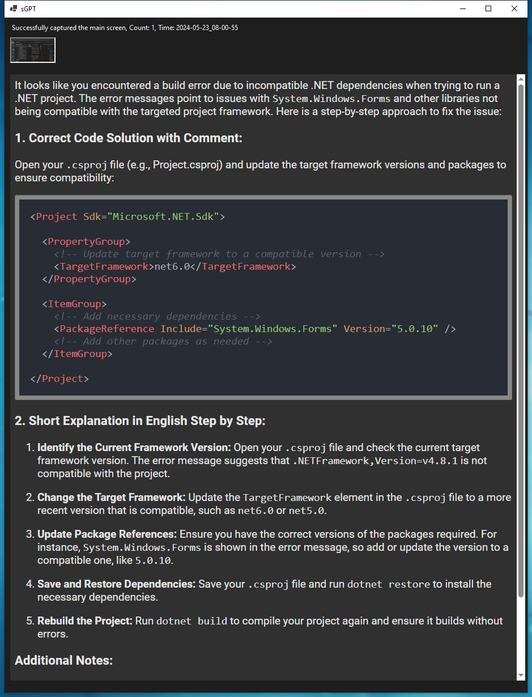

# sGPT
A C# Program which using OpenAi API to help users users to quickly communicate errors or any doubts encountered in their daily use of the computer through images in a short period of time.  
> s: simple / shot / silent

# Why sGPT
Before the introduction of GPT-4o, users could interact with ChatGPT through voice mode but needed to rely on different models to process text, audio, and visual information separately. Imagine chatting with friends where one person is responsible for listening, another for seeing, and another for speaking. Such communication efficiency is clearly limited.

GPT-4o represents a significant improvement by integrating text, visual, and audio functions into a single model, greatly enhancing efficiency. When encountering problems in daily life, it can be challenging to describe issues using simple language.   

For example, when a computer reports an ***error***, shows a pop-up with an ***issue number***, or a game or program ***fails to start***, ordinary users might not understand these specialized error codes and situations. Searching for tutorials on the internet can be tedious and cumbersome.

With sGPT, users can send an image containing the error message to GPT with a single click. The program will automatically provide relevant instructions (customizable) to solve the user's problem step-by-step.

# How to start
First, understand the structure of an OpenAI request and apply for an OpenAI API interface to use all functionalities.

Commonly used OpenAI API interfaces are divided into four categories:

- **Dialogue**
- **Private Model Training**
- **General Purpose**
- **Image & Audio**  

Dialogue and Private Model Training are the most commonly used. The Dialogue class interface, the core for human-machine dialog, is subdivided into:

- **Chat**: Multi-round dialog.
- **Completions**: Single-round dialog, mainly for generating an article at one time, without the ability to interact in multiple dialogs.

## Finding the right API endpoint
Refer to [OpenAI's official API documentation.](https://platform.openai.com/docs/api-reference/authentication) The endpoints will vary depending on the API functionality.

### Create chat completion
*Example request / default* 

    curl https://api.openai.com/v1/chat/completions \
    -H "Content-Type: application/json" \
    -H "Authorization: Bearer $OPENAI_API_KEY" \
    -d '{
        "model": "gpt-4o",
        "messages": [
        {
            "role": "system",
            "content": "You are a helpful assistant."
        },
        {
            "role": "user",
            "content": "Hello!"
        }
        ]
    }'
*Example request / image input*

    curl https://api.openai.com/v1/chat/completions \
    -H "Content-Type: application/json" \
    -H "Authorization: Bearer $OPENAI_API_KEY" \
    -d '{
        "model": "gpt-4-turbo",
        "messages": [
        {
            "role": "user",
            "content": [
            {
                "type": "text",
                "text": "What'\''s in this image?"
            },
            {
                "type": "image_url",
                "image_url": {
                "url": "https://upload.wikimedia.org/wikipedia/commons/thumb/d/dd/Gfp-wisconsin-madison-the-nature-boardwalk.jpg/2560px-Gfp-wisconsin-madison-the-nature-boardwalk.jpg"
                }
            }
            ]
        }
        ],
        "max_tokens": 300
    }'
*Example request / Streaming*

    curl https://api.openai.com/v1/chat/completions \
    -H "Content-Type: application/json" \
    -H "Authorization: Bearer $OPENAI_API_KEY" \
    -d '{
        "model": "gpt-4o",
        "messages": [
        {
            "role": "system",
            "content": "You are a helpful assistant."
        },
        {
            "role": "user",
            "content": "Hello!"
        }
        ],
        "stream": true
    }'
  
***
### Download all package that you need
`dotnet add package MouseKeyHook --version 5.6.0`  
`dotnet add package System.Net.Http`  
`dotnet add package Newtonsoft.Json`  
`dotnet add package Markdig`  
`dotnet add package DotNetEnv`  
`dotnet add package Microsoft.Web.WebView2 --version 1.0.2478.35`
`dotnet add package Microsoft.Web.WebView2`
### Create the Assets folder, if it doesn't already exist
`New-Item -ItemType Directory -Force -Path .\Assets`

### Download Highlight.js JavaScript File
`Invoke-WebRequest -Uri https://cdnjs.cloudflare.com/ajax/libs/highlight.js/11.3.1/highlight.min.js -OutFile .\Assets\highlight.min.js`

### Download Atom One Dark Style File
`Invoke-WebRequest -Uri https://cdnjs.cloudflare.com/ajax/libs/highlight.js/11.3.1/styles/atom-one-dark.min.css -OutFile .\Assets\atom-one-dark.min.css`

### using list package to check 
`dotnet list package`
